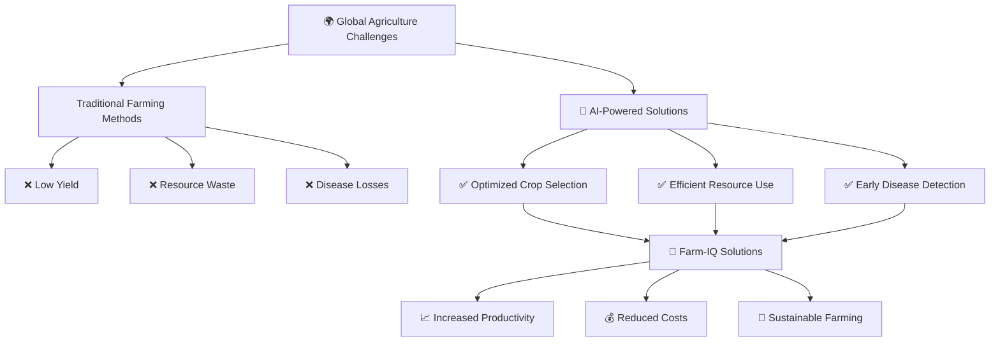
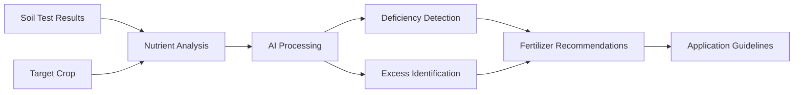
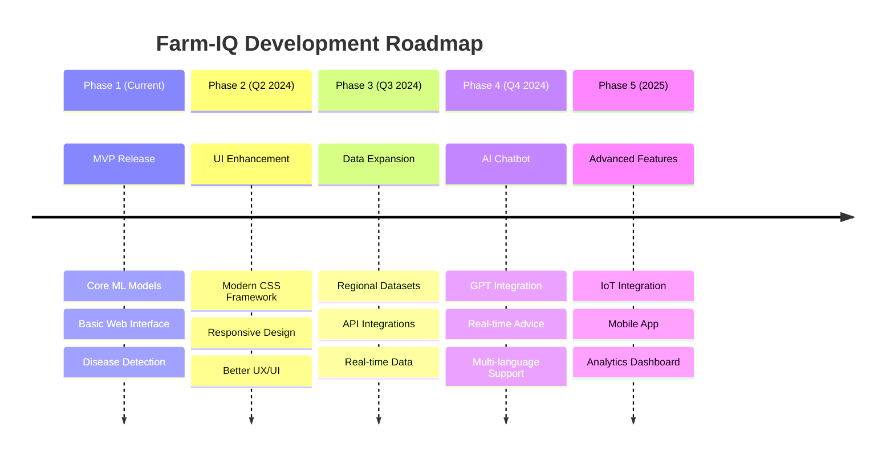

# 🌾 Farm-IQ: AI-Powered Smart Farming Assistant

<div align="center">


[](https://python.org)
[](https://flask.palletsprojects.com)
[]()
[]()

*Revolutionizing agriculture through AI-powered crop recommendations, fertilizer suggestions, and disease detection*

[🚀 Live Demo](#) • [📖 Documentation](SETUP_GUIDE.md) • [📡 API Docs](API_DOCUMENTATION.md) • [🤝 Contribute](CONTRIBUTING.md) • [📞 Contact](#contact-)

</div>

---

## 🎯 Project Overview

Farm-IQ is an intelligent farming assistant that leverages Machine Learning and Deep Learning to provide farmers with data-driven insights for optimal agricultural decisions. Our platform offers three core AI-powered features designed to maximize crop yield and minimize losses.

### ⚡ Key Features

<table>
<tr>
<td align="center" width="33%">

### 🌱 Crop Recommendation
*Smart crop selection based on soil conditions*

**Input:** Soil nutrients (N-P-K), location data  
**Output:** Optimal crop recommendations  
**Accuracy:** 99.2%  

</td>
<td align="center" width="33%">

### 🧪 Fertilizer Analysis
*Precise nutrient management system*

**Input:** Soil composition, target crop  
**Output:** Customized fertilizer recommendations  
**Benefits:** Reduced costs, improved yield  

</td>
<td align="center" width="33%">

### 🔍 Disease Detection
*AI-powered plant health diagnosis*

**Input:** Plant leaf images  
**Output:** Disease identification, confidence score & treatment  
**Coverage:** 14+ crop varieties  

</td>
</tr>
</table>

### 📊 **NEW: User Dashboard & Analytics**

Transform FarmIQ from a stateless tool into an intelligent farming companion with:

- **📈 Prediction History Tracking** - Store and review all your predictions
- **📊 Interactive Dashboard** - Visualize farming patterns with charts
- **📁 Export & Reports** - Generate CSV and PDF reports
- **🔍 Historical Analysis** - Track nutrient trends and crop patterns over time

[📖 Dashboard Documentation](DASHBOARD_DOCUMENTATION.md)


---

## ⚠️ Important Disclaimer

> **This is a Proof of Concept (POC) project.** The recommendations provided are for educational and demonstration purposes only. Do not make critical farming decisions based solely on this tool. Always consult with agricultural experts and conduct proper soil testing before making farming decisions.

---

## 🎯 Motivation & Impact

<div align="center">



</div>

### 🌟 Why Farm-IQ?

- **🇮🇳 Agriculture-Dependent Economy:** In countries like India, 60%+ population depends on agriculture
- **📊 Data-Driven Decisions:** Transform traditional farming with ML/DL insights
- **🎯 Precision Agriculture:** Optimize resource utilization and maximize yield
- **🔬 Technology Integration:** Bridge the gap between modern AI and traditional farming

---

## 📊 Datasets & Data Sources

<div align="center">

| Dataset Type | Source | Records | Accuracy |
|-------------|--------|---------|----------|
| **Crop Recommendation** | [Kaggle Dataset](https://www.kaggle.com/atharvaingle/crop-recommendation-dataset) | 2,200+ | 99.2% |
| **Fertilizer Suggestions** | [Custom Dataset](https://github.com/vannu07/Farm-IQ-AI-Powered-Smart-Farming-Assistant/blob/main/app/Data/fertilizer.csv) | 1,000+ | 95.8% |
| **Disease Detection** | [Plant Disease Dataset](https://www.kaggle.com/vipoooool/new-plant-diseases-dataset) | 87,000+ | 96.5% |

</div>

### 📓 Interactive Notebooks

Explore our research and model development:

- 🌾 **[Crop Recommendation Analysis](https://www.kaggle.com/atharvaingle/what-crop-to-grow)** - Comprehensive EDA and model comparison
- 🔬 **[Disease Detection with ResNet](https://www.kaggle.com/atharvaingle/plant-disease-classification-resnet-99-2)** - Advanced CNN implementation

---

## 🛠️ Technology Stack

<div align="center">

### Frontend Technologies


### Backend & ML/DL


### Data Science & Visualization


### Deployment & Version Control


</div>

---

## 💻 How to Use

### 🌱 Crop Recommendation System

**Step-by-Step Process:**

1. **Input Soil Data:** Enter N-P-K values (Nitrogen-Phosphorus-Potassium ratios)
2. **Location Details:** Provide state and city information
3. **Weather Integration:** System fetches real-time humidity and temperature
4. **AI Analysis:** ML model processes all parameters
5. **Recommendation:** Get optimal crop suggestions with confidence scores

> **💡 Pro Tip:** N-P-K values should be entered as ratios. Refer to [this guide](https://www.gardeningknowhow.com/garden-how-to/soil-fertilizers/fertilizer-numbers-npk.htm) for accurate measurements.

### 🧪 Fertilizer Recommendation System

**Intelligent Nutrient Analysis:**



### 🔍 Disease Detection System

**Advanced Computer Vision Pipeline:**

1. **Image Upload:** High-resolution leaf images (JPG/PNG)
2. **Preprocessing:** Image enhancement and normalization
3. **CNN Analysis:** ResNet-based disease classification
4. **Results:** Disease identification, severity assessment, treatment recommendations

#### 🌿 Supported Crops

<details>
<summary><strong>Click to view all 14 supported crops</strong></summary>

<div align="center">

| Fruits | Vegetables | Grains & Others |
|--------|------------|----------------|
| 🍎 Apple | 🌶️ Pepper | 🌽 Corn |
| 🫐 Blueberry | 🥔 Potato | 🌿 Soybean |
| 🍒 Cherry | 🍅 Tomato | 🥒 Squash |
| 🍑 Peach | 🫑 Bell Pepper | |
| 🍊 Orange | | |
| 🍇 Grape | | |
| 🍓 Strawberry | | |
| 🍇 Raspberry | | |

</div>

</details>

---

## 🚀 Local Installation Guide

### 📖 Quick Links

- **[Complete Setup Guide](SETUP_GUIDE.md)** - Detailed installation instructions
- **[API Documentation](API_DOCUMENTATION.md)** - Comprehensive API reference
- **[Contributing Guide](CONTRIBUTING.md)** - How to contribute to the project

### Prerequisites

<div align="center">

[](https://www.python.org/downloads/)
[](https://git-scm.com/download)
[](https://www.anaconda.com/) *(Optional but Recommended)*

</div>

**Required Software:**
- **Python 3.6.12** or higher (Python 3.7+ recommended for better compatibility)
- **Git** for version control
- **pip** package manager (comes with Python)
- **virtualenv** or **conda** for environment management (recommended)

### 📥 Installation Steps

#### Option 1: Using Anaconda (Recommended)

Anaconda provides better package management and avoids dependency conflicts.

1. **Clone the Repository**
   ```bash
   # For deployment-ready code (recommended)
   git clone -b deploy https://github.com/vannu07/Farm-IQ-AI-Powered-Smart-Farming-Assistant.git
   cd Farm-IQ-AI-Powered-Smart-Farming-Assistant
   
   # OR for development with training notebooks
   git clone https://github.com/vannu07/Farm-IQ-AI-Powered-Smart-Farming-Assistant.git
   cd Farm-IQ-AI-Powered-Smart-Farming-Assistant
   ```

2. **Create Python Environment**
   ```bash
   # Create conda environment with Python 3.6.12
   conda create -n Farm-IQ python=3.6.12 -y
   
   # Activate the environment
   conda activate Farm-IQ
   ```

3. **Install Dependencies**
   ```bash
   # Install all required packages from requirements.txt
   pip install -r requirements.txt
   
   # Verify installation
   pip list
   ```

4. **Launch Application**
   ```bash
   # Initialize the database (first time only)
   python init_db.py
   
   # Start the Flask development server
   cd app
   python app.py
   ```

5. **Access the Platform**
   - Open your browser and navigate to: `http://localhost:5000`
   - Or use the URL displayed in your terminal
   - Start exploring the AI-powered farming features!
   - Access the Dashboard at: `http://localhost:5000/dashboard`

#### Option 2: Using Python venv (Alternative)

If you don't have Anaconda, you can use Python's built-in venv module.

1. **Clone the Repository**
   ```bash
   git clone -b deploy https://github.com/vannu07/Farm-IQ-AI-Powered-Smart-Farming-Assistant.git
   cd Farm-IQ-AI-Powered-Smart-Farming-Assistant
   ```

2. **Create Virtual Environment**
   ```bash
   # On Windows
   python -m venv Farm-IQ-env
   Farm-IQ-env\Scripts\activate
   
   # On macOS/Linux
   python3 -m venv Farm-IQ-env
   source Farm-IQ-env/bin/activate
   ```

3. **Upgrade pip and Install Dependencies**
   ```bash
   # Upgrade pip to latest version
   python -m pip install --upgrade pip
   
   # Install all dependencies
   pip install -r requirements.txt
   ```

4. **Run the Application**
   ```bash
   # Initialize the database (first time only)
   python init_db.py
   
   # Start the Flask server
   cd app
   python app.py
   ```

5. **Access in Browser**
   - Navigate to: `http://localhost:5000`

### 🔧 Troubleshooting

<details>
<summary><strong>Common Issues & Solutions</strong></summary>

#### Issue: ModuleNotFoundError
**Solution:** Make sure your virtual environment is activated and all dependencies are installed:
```bash
conda activate Farm-IQ  # or source Farm-IQ-env/bin/activate
pip install -r requirements.txt
```

#### Issue: Port 5000 already in use
**Solution:** Either stop the process using port 5000, or specify a different port:
```bash
python app.py --port 8000
```

#### Issue: TensorFlow/PyTorch installation fails
**Solution:** Install these packages separately with specific versions:
```bash
pip install tensorflow==2.4.0
pip install torch==1.7.0
```

#### Issue: Permission denied errors
**Solution:** Run with appropriate permissions or use a virtual environment to avoid system-wide installations.

</details>

### 🌿 Branch Information

- **`main` branch:** Complete development code with training notebooks, datasets, and research materials
- **`deploy` branch:** Production-ready streamlined code (recommended for local setup and deployment)

### 📦 Key Dependencies

The project relies on these major packages:
- **Flask 1.1.2** - Web framework
- **scikit-learn 0.23.2** - Machine Learning models
- **TensorFlow/PyTorch** - Deep Learning for disease detection
- **pandas 1.1.4** - Data manipulation
- **numpy 1.19.4** - Numerical computing
- **matplotlib 3.3.3** - Data visualization

For a complete list, see [requirements.txt](requirements.txt)

---

## 🤝 Contributing

We welcome contributions from the agricultural and AI community! 

### 🔄 Contribution Workflow

1. **Fork** the repository
2. **Create** a feature branch (`git checkout -b feature/AmazingFeature`)
3. **Commit** your changes (`git commit -m 'Add AmazingFeature'`)
4. **Push** to the branch (`git push origin feature/AmazingFeature`)
5. **Open** a Pull Request

Please read our [CONTRIBUTING.md](https://github.com/vannu07/Farm-IQ-AI-Powered-Smart-Farming-Assistant/blob/main/Contributing.md) for detailed guidelines.

---

## 📈 Future Roadmap

<div align="center">



</div>

### 🎯 Upcoming Features

| Feature | Priority | Status | Expected Release |
|---------|----------|--------|------------------|
| 🎨 **Modern UI/UX** | High | 🔄 In Progress | Q2 2024 |
| 🌍 **Regional Data** | High | 📋 Planned | Q2 2024 |
| 🤖 **AI Chatbot** | Medium | 📋 Planned | Q3 2024 |
| 📊 **Analytics Dashboard** | Medium | 📋 Planned | Q4 2024 |
| 📱 **Mobile App** | Low | 💭 Concept | 2025 |

---

## ⚙️ Usage & License

### 📝 Academic & Research Use

This project is available for:
- ✅ Educational purposes
- ✅ Research and development
- ✅ Non-commercial applications
- ✅ Open source contributions

**Attribution Required:** Please cite this repository in your work and include the original source link.

### 📄 License

This project is licensed under the [GNU General Public License v3.0](https://github.com/vannu07/Farm-IQ-AI-Powered-Smart-Farming-Assistant/blob/main/LICENSE).

---

## 🙏 Acknowledgments

### 🌟 Special Thanks

This project builds upon the excellent foundation provided by:
- **[7NNS7's Farming Recommendation System](https://github.com/7NNS7/Recommendation-System-for-Farming)** - Core inspiration for crop and fertilizer recommendation modules
- **Kaggle Community** - For providing high-quality agricultural datasets
- **Open Source Community** - For the amazing ML/DL libraries and frameworks

> 💡 **Note:** Please star the original repositories that inspired this work!

---

## 📞 Contact & Support

<div align="center">

### 🤝 Get in Touch

[](https://www.linkedin.com/in/varnit-kumar-0883bb251/)
[](mailto:your-email@example.com)
[](https://github.com/vannu07)

</div>

### 💬 Support Options

- 🐛 **Bug Reports:** [Create an Issue](https://github.com/vannu07/Farm-IQ-AI-Powered-Smart-Farming-Assistant/issues)
- 💡 **Feature Requests:** [Discussion Forum](https://github.com/vannu07/Farm-IQ-AI-Powered-Smart-Farming-Assistant/discussions)
- 📧 **Direct Contact:** LinkedIn or Email for collaboration opportunities

---

<div align="center">

### 🌱 Made with ❤️ by Varnit Kumar

**Farm-IQ** • *Empowering Farmers with AI* • **2025**

[](https://github.com/vannu07/Farm-IQ-AI-Powered-Smart-Farming-Assistant/stargazers)
[](https://github.com/vannu07/Farm-IQ-AI-Powered-Smart-Farming-Assistant/network)
[](https://github.com/vannu07/Farm-IQ-AI-Powered-Smart-Farming-Assistant/watchers)

</div>

